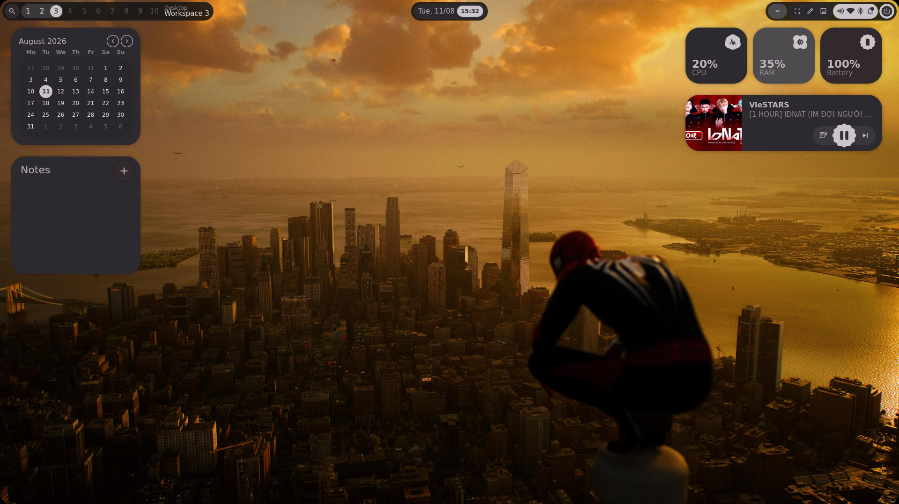
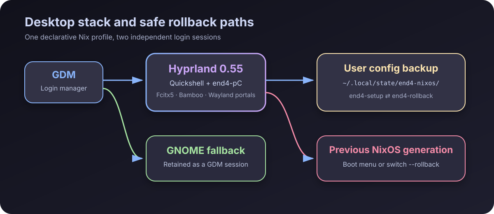
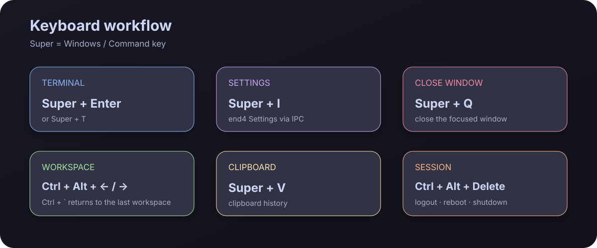

# NixOS + Hyprland end4


A personal NixOS configuration centered around **Hyprland + end4-pC**, with
Vietnamese input support, a development-focused workflow, and a safe fallback
to GNOME.

> Hyprland is the default desktop session. GNOME and GDM remain installed as a
> known-good fallback if the theme, GPU stack, or Wayland configuration fails.

## Desktop preview



The desktop stack includes:

- **Hyprland 0.55** as the Wayland compositor.
- **end4-pC** on **Quickshell 0.2.1** for the bar, launcher, overview,
  notifications, wallpaper, and Settings.
- `foot` as the default terminal.
- Fcitx5 + Bamboo for Vietnamese input.
- GDM for login management, with GNOME retained as a fallback session.

## Architecture and rollback paths



The desktop sources are pinned in `flake.lock`, so rebuilds do not silently
pull newer Hyprland or end4 revisions. `end4-setup` only replaces these two
directories:

```text
~/.config/hypr
~/.config/quickshell
```

Before replacing them, the script creates a timestamped backup under:

```text
~/.local/state/end4-nixos/backups/
```

## Installation

```bash
git clone git@github.com:nvtank/NixOSConfig.git /etc/nixos
cd /etc/nixos

# Build first without changing the running system
nix build .#nixosConfigurations.nixos.config.system.build.toplevel --no-link

# Persist a new generation while retaining older generations in the boot menu
sudo nixos-rebuild switch --flake path:/etc/nixos#nixos

# Run as the desktop user, never as root
end4-setup
```

Log out and sign in again. GDM preselects **Hyprland**, while password
authentication remains enabled.

## Essential shortcuts



| Shortcut | Action |
|---|---|
| `Super + Enter` / `Super + T` | Open a terminal |
| `Super + Q` | Close the focused window |
| `Super + 1…0` | Jump directly to a workspace |
| `Ctrl + Alt + ←/→` | Previous/next workspace |
| `Ctrl + \`` | Return to the last-used workspace |
| `Super + I` | Open end4 Settings |
| `Super + /` | Open the full shortcut cheat sheet |
| `Super + V` | Open clipboard history |
| `Super + Shift + S` | Capture a screen region |
| `Ctrl + Alt + Delete` | Open the logout/reboot/power menu |

The touchpad uses natural scrolling (`natural_scroll = true`). Bamboo is the
default input method and starts specifically with the Hyprland session.

## Repository layout

```text
/etc/nixos
├── flake.nix
├── flake.lock
├── configuration.nix
├── hardware-configuration.nix
├── docs/images/
│   ├── hyprland-desktop.png
│   ├── hyprland-stack.svg
│   └── hyprland-shortcuts.svg
└── modules/
    ├── base.nix
    ├── desktop.nix             # GNOME/GDM fallback
    ├── dev.nix
    ├── end4-hyprland.nix       # Hyprland, Quickshell, setup/rollback
    ├── end4-execs.lua          # Hyprland-specific autostart
    ├── end4-keybinds.lua       # Workspace shortcuts
    ├── end4-variables.lua      # end4-pC selection and Settings IPC
    ├── packages.nix
    ├── shell.nix
    ├── terminal.nix
    ├── ui.nix
    ├── user.nix
    └── vietnamese.nix          # Fcitx5 + Bamboo
```

## Safe updates

```bash
cd /etc/nixos
git pull --ff-only

# Always build first
nix build .#nixosConfigurations.nixos.config.system.build.toplevel --no-link

# Test without changing the default boot generation
sudo nixos-rebuild test --flake path:/etc/nixos#nixos

# Persist only after login, panel, and input-method checks pass
sudo nixos-rebuild switch --flake path:/etc/nixos#nixos
```

Avoid running `nix flake update` blindly. Hyprland, Quickshell,
dots-hyprland, and end4-pC are pinned to prevent unexpected API changes.

## Rollback

### User theme and configuration

```bash
end4-rollback
```

Log out and select GNOME in GDM if necessary.

### NixOS generation

- Select an older generation from the boot menu, or
- run `sudo nixos-rebuild switch --rollback` from a working session.

The Git history is also split into focused phases, making it possible to
revert the compositor, theme, input/keybind workflow, or Settings compatibility
fix independently.

## Quick verification

```bash
Hyprland --version
qs --version
hyprctl configerrors
fcitx5-remote -n
systemctl is-active display-manager.service
```

Expected results: Hyprland `0.55.0`, Quickshell `0.2.1`, no configuration
errors, `bamboo` as the input method, and an `active` display manager.
